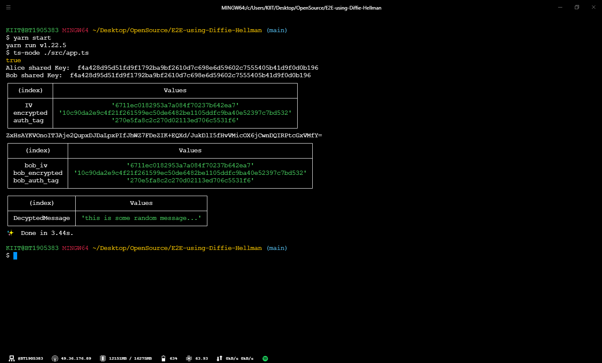
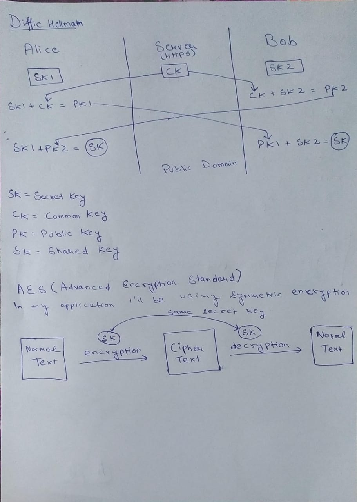
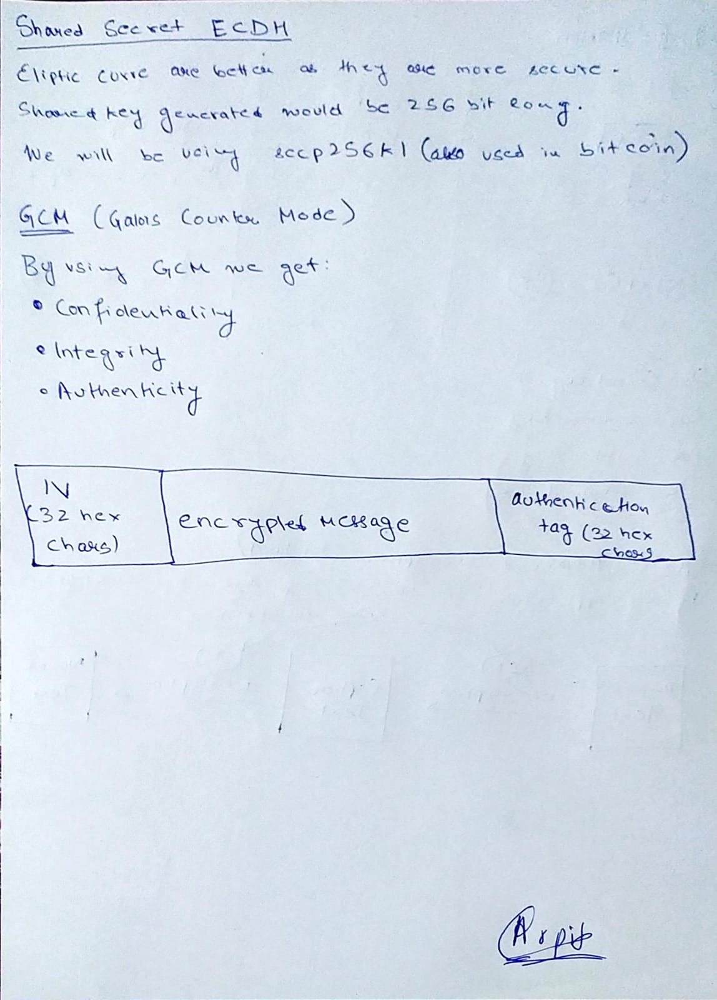

# E2E-Encryption-using-Diffie-Hellman

End-to-End encryption with **Typescript** using **AES256 GCM ECDH**

<div align="center">
	
</div>

## Installation

```sh-session
git clone https://github.com/marpit19/E2E-Encryption-using-Diffie-Hellman.git

cd E2E-Encryption-using-Diffie-Hellman

npm install

npm start
```

## Some behind the scene work on paper

<div align="center">
	
    
</div>

## License

Copyright (c) **Arpit Mohapatra**. All rights reserved. Licensed under the MIT License

[](https://forthebadge.com)
